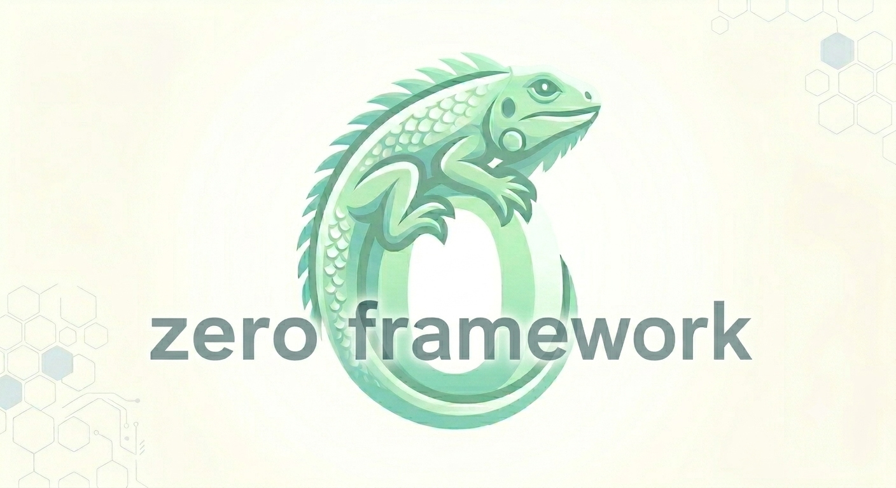

<br/>
<p align="center">
    <table>
    <tr style="background-color: #f8f8f8; text-align: center;">
        <th style="padding: 12px; border: 1px solid #ddd;">Documentation</th>
        <th style="padding: 12px; border: 1px solid #ddd;">DeepWiki</th>
        <th style="padding: 12px; border: 1px solid #ddd;">Coverage</th>
        <th style="padding: 12px; border: 1px solid #ddd;">Build Status</th>
    </tr>
    <tr style="text-align: center;">
        <td style="padding: 12px; border: 1px solid #ddd;"><a href="https://zerofmk.in">zerofmk.in</a></td>
        <td style="padding: 12px; border: 1px solid #ddd;"><a href="https://deepwiki.com/badge.svg"></a></td>
        <td style="padding: 12px; border: 1px solid #ddd;"></td>
        <td style="padding: 12px; border: 1px solid #ddd;"><a href="https://github.com/im-ng/zero/workflows/CI/badge.svg"></a></td>
    </tr>
    </table>
</p>
<br/>

**Zero** is a strongly opinionated web framework written in Zig, built on top of http.zig that aims for zero allocations and created to make development easier while keeping performance and observability in mind.

**Zero** framework is completely configurable, you may isolate and attach best-in-class built-in solutions as you see fit using the 12 Factor App methodology.

**Zero** framework has useful features like drop-in support for numerous `databases`, `queuing systems`, and external services, as well as `REST`, `authentication`, `logging`, `metrics`, `observability`, and `scheduling`.

### Zero mascot

<p>

</p>

### Zig version support

_*An `experimental` support has been added to achieve the zig version 0.16 addition for the zero framework. For all stable work, prefer to use the `main` branch itself.*_

| Branch           | Version |
| ---------------- | ------- |
| **experimental** | 0.16.0  |
| **main**         | 0.15.2  |

## Table of Contents

- [Features](#features)
- [Requirements](#requirements)
- [Installation](#installation)
- [Quick Start](#quick-start)
- [Project Structure](#project-structure)
- [Configuration](#configuration)
- [Resilience](#resilience)
- [Metrics](#metrics)
- [Examples](#examples)
- [GraphQL](#graphql)
- [Protobuf](#protobuf)
- [Testing](#testing)
- [Benchmark](#benchmark)
- [Zig Version Compatibility](#zig-version-compatibility)
- [Known Gotchas](#known-gotchas)
- [Attributions](#attributions)
- [License](#license)

## Features

| Category        | Status | Details                                         |
| --------------- | ------ | ----------------------------------------------- |
| REST / CRUD     | ✅     | Build standard REST endpoints out-of-box        |
| Configuration   | ✅     | `.env` with per-environment overrides           |
| Logging         | ✅     | Structured, UTC timestamps                      |
| Metrics         | ✅     | App, HTTP, SQL, KV + process/memory stats       |
| Tracing         | ✅     | TraceID middleware, request-level tracing       |
| Auth Middleware | ✅     | Basic, API Key, OAuth 2.0                       |
| CORS            | ✅     | Configurable CORS middleware                    |
| Panic Recovery  | ✅     | Automatic panic recovery                        |
| Databases       | ✅     | PostgreSQL, SQLite, Redis                       |
| Pub/Sub         | ✅     | MQTT, NATS, Kafka (via librdkafka), Redis        |
| Migrations      | ✅     | DB migrations + seed on startup                 |
| HTTP Client     | ✅     | Register multiple external services             |
| Cron Jobs       | ✅     | `* * * * *` + second-level + range support      |
| WebSockets      | ✅     | Built-in WebSocket support                      |
| Static Files    | ✅     | Serve static assets + Swagger UI; `addStaticFiles` mounts   |
| Health Checks   | ✅     | Liveness + status endpoints                     |
| GraphQL         | ✅     | Schema-less resolvers over HTTP (POST/GET)      |
| Protobuf        | ✅     | proto3 codegen + bind/decode & encode over HTTP |

See [feature_parity.md](./feature_parity.md) for the full roadmap and upcoming features.

## Requirements

- **Zig 0.16.0** (tested and experimental baseline)
- **librdkafka** — required for Kafka support:
  ```bash
  sudo apt install librdkafka-dev   # Linux
  brew install librdkafka           # macOS
  ```

## Installation

Add zero to your project:

```bash
zig fetch --save https://github.com/im-ng/zero/archive/refs/heads/experimental.zip
```

## Quick Start

### 1. Initialize your project

```bash
mkdir zero-web-app && cd zero-web-app
zig init
zig fetch --save https://github.com/im-ng/zero/archive/refs/heads/experimental.zip
```

### 2. Configure `build.zig`

```zig
const zero = b.dependency("zero", .{});

const exe = b.addExecutable(.{
    .name = "myapp",
    .root_module = b.createModule(.{
        .root_source_file = b.path("src/main.zig"),
        .target = target,
        .optimize = optimize,
    }),
});

exe.root_module.addImport("zero", zero.module("zero"));
b.installArtifact(exe);
```

### 3. Create config directory

```bash
mkdir configs
touch configs/.env
```

### 4. Write your app

```zig
const std = @import("std");
const zero = @import("zero");

const App = zero.App;
const Context = zero.Context;
const utils = zero.utils;

pub const std_options: std.Options = .{
    .logFn = zero.logger.custom,
};

pub fn main(init: std.process.Init) !void {
    utils.setIo(init.io);

    var gpa: std.heap.DebugAllocator(.{}) = .init;
    const allocator = gpa.allocator();
    _ = gpa.detectLeaks();

    const app = try App.new(allocator, init.environ_map);
    try app.get("/json", jsonResponse);
    try app.run();
}

pub fn jsonResponse(ctx: *Context) !void {
    try ctx.json(.{ .msg = "hello from zero!" });
}
```

### 5. Run

```bash
zig build run
```

```
 INFO [03:23:39] Loaded config from file: ./configs/.env
 INFO [03:23:39] Starting server on port: 8080
```

See [full documentation](https://zerofmk.in/) for detailed guides on authentication, databases, cron jobs, websockets, and more.

## Project Structure

| Directory         | Purpose                                     |
| ----------------- | ------------------------------------------- |
| `src/datasource/` | PostgreSQL (`SQL`), Redis (`Cache`)         |
| `src/pubsub/`     | MQTT, NATS and Kafka publishers/subscribers |
| `src/cronz/`      | Cron scheduler and job execution            |
| `src/migration/`  | Database migrations and seeding             |
| `src/mw/`         | Middleware: auth, tracing, websocket        |
| `src/service/`    | HTTP client for external services           |
| `src/http/`       | Error types and HTTP utilities              |
| `src/zsutil/`     | System utils: memory, CPU, process, host    |
| `src/static/`     | Embedded Swagger UI assets                  |

Key entry points:

- `src/zero.zig` — re-exports all public types
- `src/app.zig` — main `App` struct (`App.new()`, `app.run()`)
- `src/context.zig` — request context with `.SQL`, `.Cache`, `.GetService()`

## Configuration

Zero loads config from `configs/.env` at startup, with per-environment overrides (e.g. `configs/.dev.env` when `APP_ENV=dev`).

```bash
# Application
APP_NAME=myapp
APP_VERSION=1.0.0
APP_ENV=dev

# Logging
LOG_LEVEL=debug

# PostgreSQL
# DB_HOST=localhost
# DB_USER=user1
# DB_PASSWORD=password1
# DB_NAME=mydb
# DB_PORT=5432
# DB_DIALECT=postgres
# DB_SSL_MODE=disable            # disable | require | verify-ca | verify-full
# DB_TLS_ROOT_CA=               # CA cert path for verify-* modes (empty = system trust store)

# Redis
# REDIS_HOST=127.0.0.1
# REDIS_PORT=6379
# REDIS_USER=redis
# REDIS_PASSWORD=password
# REDIS_DB=0
# REDIS_TLS_ENABLED=false

# Kafka
# KAFKA_BROKER=localhost:9092

# MQTT
# MQTT_HOST=localhost
# MQTT_PORT=1883

# Authentication
# AUTH_MODE=Basic
```

All keys are commented out by default; features activate only when uncommented. See [config.md](./config.md) for the full list.

## Resilience

Zero ships a set of **opt-in** resilience features. All are off by default (or
preserve prior behavior), so existing apps are unaffected; enable them via
`configs/.env`.

### Inbound request timeout & bulkhead

- **Request timeout** — a stalled client can't pin a worker forever. Default
  `30s`; override with `ZERO_REQUEST_TIMEOUT_MS` (read from `configs/.env`).
- **Bulkhead** — cap concurrent in-flight requests. When `INBOUND_MAX_CONCURRENT`
  is exceeded the server replies `503` instead of queuing, protecting it from
  overload:

  ```bash
  INBOUND_MAX_CONCURRENT=100          # 0 = unlimited (default)
  ```

### Circuit breakers for datasources

The SQL datasource (`ctx.SQL`) and the KV/Redis cache (`ctx.KV`) can each be
guarded by a circuit breaker — the same `circuit_breaker.zig` used for outbound
services. After `failure_threshold` (5) consecutive failures the breaker trips
*open* and calls fail fast with `error.CircuitOpen` until the cooldown (`30s`)
elapses and a half-open trial succeeds:

```bash
SQL_CIRCUIT_BREAKER_ENABLE=true      # guard Postgres/SQLite queries & writes
CACHE_CIRCUIT_BREAKER_ENABLE=true    # guard KV store (Redis) operations
```

### Pub/Sub reconnect & dead-letter

MQTT, NATS, Redis and Kafka consumers transparently **reconnect and
re-subscribe** after a broker drop, and **retry** handler failures
(3× / 500ms) before dead-lettering a poison message to a `<topic>/dlq`
(Kafka `__dlq`). Dead-letter events are counted on the metrics endpoint.

### Structured logging

Set `LOG_FORMAT=json` to emit one JSON object per log line
(`{"ts":...,"level":...,"msg":...}`) for log pipelines:

```bash
LOG_FORMAT=json
```

### Config required-keys

- **Required keys** — fail fast at startup if any listed key is missing/empty:
  `REQUIRED_CONFIG_KEYS=DB_HOST,DB_NAME`.

## KV Store

`zero` exposes a unified, type-erased KV store so handlers don't depend on a
specific backend. The Redis client (when configured) is auto-registered as the
default store; additional stores are registered at startup:

```zig
// backend: .redis | .nats_kv | .memory | .sqlite
try app.addKVStore("feature-flags", .memory, .{});
try app.addKVStore("sessions", .nats_kv, .{ .bucket = "sessions" });
```

In a handler:

```zig
// default store (Redis when configured), or a named store
const kv = ctx.KV orelse ctx.GetKVStore("sessions") orelse return error.NoKV;

try kv.set(ctx, "user:1", "active");
const v = try kv.get(ctx, "user:1");      // ?[]const u8, caller-owned (free with ctx.allocator)
defer if (v) |s| ctx.allocator.free(s);
const has = try kv.exists(ctx, "user:1");
try kv.delete(ctx, "user:1");
try kv.expire(ctx, "user:1", 60_000);     // ms; unsupported on nats_kv
```

Backends: **Redis** (okredis), **NATS JetStream KV** (reuses the `nats`
dependency; needs a JetStream-enabled connection), **in-memory** (zero
dependencies, handy for tests), and **SQLite** (reuses the `SQLite`
datasource, `kv(k,v,exp)` table). `Badger` is intentionally not provided — it
is a Go library and cannot be used from pure Zig without cgo.

## File Store

 `zero` exposes a unified `FileStore` interface for blob storage, plus helpers
for handling `multipart/form-data` uploads and serving downloads. The `local`
backend (rooted at `FILE_STORE_ROOT`, with `..` traversal protection) is
implemented; `FTP`/`SFTP` backends are **deferred** (no vendored Zig libs; SFTP
needs libssh). The `local` store auto-registers as the default when
`FILE_STORE_ROOT` is set, and additional stores are registered at startup:

```zig
try app.addFileStore("avatars", .local, .{ .root = "./data/avatars" });
```

### S3-compatible file store

The `s3` backend talks to any S3-compatible service (AWS S3, MinIO, Cloudflare
R2, DigitalOcean Spaces, Backblaze B2) using **AWS Signature Version 4** over the
built-in HTTP client. Every object key maps directly to an S3 key under the
bucket (`create(ctx, "avatars/1.png", ...)` → `PUT /<bucket>/avatars/1.png`).

```zig
// configs/.env
//   FILE_STORE_BACKEND=s3
//   S3_REGION=us-east-1
//   S3_BUCKET=my-bucket
//   S3_ACCESS_KEY=...
//   S3_SECRET_KEY=...
//   S3_ENDPOINT=https://s3.us-east-1.amazonaws.com   # optional; default AWS per region
try app.addFileStore("assets", .s3, .{});

// in a handler — same interface as the local store
try ctx.SaveFileToStore("assets", "report.pdf", data);
const blob = (try ctx.GetFileFromStore("assets", "report.pdf")) orelse return error.NotFound;
```

- The signing logic (`signAuthorization`) is pure and covered by unit tests
  against the AWS SigV4 `get-vanilla` test vector (RFC 4231 HMAC vectors too).
- `x-amz-content-sha256` and `x-amz-date` are signed per S3's requirements; keys
  are URI-encoded (slashes preserved) in both the request URL and the signature.

In a handler:

```zig
// 1) handle a multipart upload — `f.data` is arena-owned and valid only for
//    the duration of the request, so copy it into a store to persist it.
if (try ctx.GetFile("avatar")) |f| {
    try ctx.SaveFileToStore("avatars", f.filename, f.data);
}

// 2) read a file back from a named store. The returned slice is request-arena
//    owned (valid through the response write) — do NOT free it yourself.
const bytes = (try ctx.GetFileFromStore("avatars", "user1.png")) orelse
    return error.NotFound;
// use `bytes` (e.g. ctx.response.writer().writeAll(bytes)) …

// 3) serve a file from local disk as a download (Content-Type by extension +
//    Content-Disposition: attachment).
try ctx.File("./public/report.pdf");
```

`ctx.FileStore` is the default store; `ctx.GetFileStore(name)` looks up a named
one. `SaveFileToStore` accepts caller-owned `data`. `GetFileFromStore` returns a
request-arena slice (freed when the request ends) — stream it to the client with
`ctx.response.writer().writeAll(...)` rather than assigning it to
`ctx.response.body` (the arena is reset before `response.body` is flushed).

The HTTP server enables `multipart/form-data` parsing by default (32 MB body /
32 fields), so `ctx.GetFile` works without extra configuration.

## Auto CRUD

`zero` can scaffold REST handlers for a struct in one line, mirroring GoFr's
`AddRESTHandlers`:

```zig
const User = struct { id: i64, name: []const u8, email: []const u8 };

try app.addRestHandlers(User, .{ .resource = "users" });
// GET    /users        list   (LIMIT 100)
// GET    /users/:id    get one
// POST   /users        create (body -> struct, 201)
// PUT    /users/:id    update (re-selects and returns the row)
// DELETE /users/:id    delete (204-style {deleted: n})
```

The generated SQL is emitted for **both** Postgres (`$N` placeholders) and
SQLite (`?`) and dispatched at runtime on `ctx.SQL.dialect`, so the same struct
works against either backend. Rules:

- `resource` is the URL segment. `table` defaults to `resource` (override via
  `opts.table`).
- The primary key is auto-detected as the field named `id`; override with
  `opts.id_field`. The struct must have that field or it fails to compile.
- Struct **field names map to column names exactly** (the `pgz` mapper is
  reused), so name your columns to match. `POST`/`PUT` bind the request JSON into
  the struct.
- The primary key is taken from the request body on create (supply it) and from
  the `:id` path param on get/update/delete.

Auto CRUD does not create the table — run your migration (or `ctx.SQL.exec`)
first, as the `examples/zero-autocrud` demo does with a `/init` handler.

## Metrics

Zero collects app, HTTP, SQL, KV, and process/memory metrics out of the box and exposes them
in Prometheus format on a **separate metrics port** (`METRICZ_PORT`, default `2121`) at
`/metrics` — independent of the main HTTP server.

You can also register your own **custom metrics** so applications can instrument domain-specific
behavior. Use `app.Metric()` (which returns the shared `metricz` registry) to register a
counter, gauge, or histogram, then update it from your handlers:

```zig
const std = @import("std");
const zero = @import("zero");
const App = zero.App;
const Context = zero.Context;
const metrics = zero.metricz;
const utils = zero.utils;

// module-level handles assigned once at startup
var http_requests_total: *metrics.CounterVec(u64, struct { method: []const u8, path: []const u8 }).Impl = undefined;
var queue_depth: *metrics.GaugeVec(u64, struct { name: []const u8 }).Impl = undefined;
var request_latency_seconds: *metrics.HistogramVec(f64, struct { route: []const u8 }, &.{ 0.01, 0.05, 0.1, 0.5, 1.0 }).Impl = undefined;

pub fn main(init: std.process.Init) !void {
    utils.setIo(init.io);
    var gpa: std.heap.DebugAllocator(.{}) = .init;
    const allocator = gpa.allocator();
    const app = try App.new(allocator, init.environ_map);

    // register custom metrics (the label set is a plain struct)
    http_requests_total = try app.Metric().Counter(struct { method: []const u8, path: []const u8 }, allocator, "http_requests_total", "Total HTTP requests.");
    queue_depth = try app.Metric().Gauge(struct { name: []const u8 }, allocator, "queue_depth", "Current queue depth.");
    request_latency_seconds = try app.Metric().Histogram(struct { route: []const u8 }, allocator, "request_latency_seconds", &.{ 0.01, 0.05, 0.1, 0.5, 1.0 }, "Request latency in seconds.");

    try app.get("/work", workHandler);
    try app.run();
}

fn workHandler(ctx: *Context) !void {
    try http_requests_total.incr(.{ .method = "GET", .path = "/work" });
    try queue_depth.set(.{ .name = "orders" }, 3);
    try request_latency_seconds.observe(.{ .route = "/work" }, 0.042);
    try ctx.json(.{ .ok = true });
}
```

Scrape the metrics endpoint:

```bash
curl http://localhost:2121/metrics | grep http_requests_total
# HELP http_requests_total Total HTTP requests.
# TYPE http_requests_total counter
# http_requests_total{method="GET",path="/work"} 1
```

Set the port via `configs/.env`:

```bash
METRICS_PORT=2121
```

#### Failure metrics

Two counters track resilience events and are exposed in the same Prometheus
format:

- `app_circuit_open_total{name="<downstream>"}` — outbound circuit-breaker open events.
- `app_pubsub_dlq_total{topic="...",consumer="dlq"}` — messages dead-lettered by a pub/sub consumer (after retries are exhausted).

These let you alert on downstream outages (`circuit_open_total` climbing) and on
poison messages (`dlq_total` > 0) without adding instrumentation to your
handlers.

### Remote log level (pull from a central service)

Instead of exposing an endpoint, the service can _pull_ its log level from a remote
log-level service. Set `REMOTE_LOG_URL` (and optionally `REMOTE_LOG_FETCH_INTERVAL`) in
`configs/.env`; on startup zero registers an outbound HTTP client for that URL and a cron job
that fetches the level every `REMOTE_LOG_FETCH_INTERVAL` seconds (default 15) and applies it
in-process. Nothing is exposed on this service, and the feature is entirely opt-in.

```bash
# configs/.env
REMOTE_LOG_URL=https://log-service.com/log-levels
REMOTE_LOG_FETCH_INTERVAL=15
```

The remote endpoint must return the level as JSON:

```json
{ "level": "debug" }
```

Valid levels: `debug`, `info`, `warn`, `error`, `fatal`, `none`. An unrecognized value in the
response is ignored (the current level is left unchanged). The fetch rides the framework's
outbound client, so auth and the circuit breaker apply automatically.

### Correlation ID

The tracing middleware (`tracz`) reuses an inbound `X-Correlation-ID` header if present
(otherwise it mints a UUID) and stamps it on the response. That id is then propagated
automatically: the outbound HTTP client attaches it to every upstream request, and Kafka
`publish` writes it as a record header — so a single correlation id flows across services
and brokers without extra code.

### Rate Limiter

A fixed-window rate limiter runs as the first middleware in the chain. It is opt-in via
config and exempts `/.well-known/*` (so the health endpoint is never throttled).

```bash
RATE_LIMIT_ENABLE=true          # default false (middleware is a pass-through)
RATE_LIMIT_MAX=100              # max requests per window (default 100)
RATE_LIMIT_WINDOW=60            # window length in seconds (default 60)
RATE_LIMIT_KEY=ip               # default: bucket by client Address
# RATE_LIMIT_KEY=header:X-Forwarded-For   # bucket by an inbound header instead (behind a proxy)
```

When a client exceeds the limit, the server replies `429 Too Many Requests`
(`rate limit exceeded`). Buckets are keyed by an `XxHash3` of the client address (or the
configured header) and reset at the start of each window; an internal cap bounds the number
of tracked clients. Future options — token bucket, sliding window, per-route limits,
Redis-backed distributed limiting, and `X-RateLimit-*` / `Retry-After` headers — are tracked
in `parity_check.md`.

#### Outbound (downstream service) rate limiter

Each registered HTTP service (`app.addHttpService`) can carry its own fixed-window limiter
that guards every `get`/`post`/`put`/`delete` call to that downstream. It fails fast — when
the per-service window is exhausted the call returns `error.RateLimited` (surfaced as
`ClientError.RateLimited`) before any socket is opened, so it composes with the circuit
breaker and outbound auth.

Configure it explicitly via `ServiceOptions`:

```zig
const svc = app.addHttpService(
    "payments",
    "https://payments.internal",
    .{ .rateLimiter = .{ .allocator = app.container.allocator, .enabled = true, .limit = 50, .window_ms = 60_000 } },
);
```

Or per-service env defaults (service name uppercased, non-alphanumeric → `_`):

```bash
SERVICE_PAYMENTS_RATE_LIMIT=50              # max requests per window (default 100)
SERVICE_PAYMENTS_RATE_LIMIT_WINDOW_MS=60000  # window length in ms (default 60000)
```

`SERVICE_<NAME>_RATE_LIMIT` is resolved independently of the other `SERVICE_<NAME>_*` keys
(auth/circuit-breaker); explicit `ServiceOptions.rateLimiter` always wins.

### RBAC (role-based access control)

A config-driven RBAC middleware runs *after* authentication. It reads the `role` claim from the
verified JWT and allows the request only when that role is granted the current `method`+`path`
by a registered rule. Routes with no matching rule are public; a route with at least one rule
requires the caller's role to match one of them. A request without a `role` claim (or without an
auth header) is denied with `403 Forbidden` on protected routes. `*.well-known/*`, `/metrics`,
health and liveness are always exempt.

`method` may be `*` to match any verb; `path` may end with `*` as a prefix wildcard
(e.g. `/api/*` covers `/api/users/1`).

Register rules programmatically:

```zig
// role "ADMIN" may do anything under /api; "USER" may only GET /api/resource
app.rbac("ADMIN", "*", "/api/*");
app.rbac("USER", "GET", "/api/resource");
```

Or load them from the environment, where each `RBAC_ROLE_<NAME>` key lists comma-separated
`METHOD:/path` rules:

```bash
RBAC_ROLE_ADMIN=GET:/api/*,POST:/api/*,PUT:/api/*,DELETE:/api/*
RBAC_ROLE_USER=GET:/api/resource
```

```zig
try app.rbacFromEnv();
```

The role is taken from the JWT `role` claim, so the issuer must embed a `role` field in the
token (the claim is optional — tokens without it carry no role and are denied on protected
routes). RBAC is intended for OAuth/JWT auth; Basic/API-key auth has no role claim.

#### JSON config (env file or `config.json`)

Rules can also be supplied as a JSON document, which is handy for `.env` files
(`RBAC_CONFIG`) or a `config.json` loaded at startup. Two shapes are accepted — an array of
`{role, method, path}` objects, or an object mapping each role to a list of `METHOD:/path`
strings:

```json
[
  { "role": "ADMIN", "method": "*",        "path": "/api/*" },
  { "role": "USER",  "method": "GET",      "path": "/api/resource" }
]
```
```json
{ "ADMIN": ["GET:/api/*", "POST:/api/*"], "USER": ["GET:/api/resource"] }
```

Wire it up from the environment (`RBAC_CONFIG` holds the JSON string) or from a file:

```zig
// reads RBAC_ROLE_<NAME> env keys AND the RBAC_CONFIG JSON string
try app.rbacFromEnv();

// or load a JSON document from a file (e.g. config.json)
try app.rbacFromJsonFile("config.json");

// or parse an in-memory JSON string directly
try app.rbacFromJson(
    \\[{"role":"ADMIN","method":"*","path":"/api/*"}]
);
```

### Redis Pub/Sub

Zero ships a native Redis Pub/Sub backend (RESP `PUBLISH`/`SUBSCRIBE`) — no extra dependency
beyond the Redis connection already used for caching. Select it with `PUBSUB_BACKEND=REDIS`
(reusing `REDIS_HOST`/`REDIS_PORT`/`REDIS_USER`/`REDIS_PASSWORD`/`REDIS_DB`):

```bash
PUBSUB_BACKEND=REDIS
REDIS_HOST=127.0.0.1
REDIS_PORT=6379
```

```zig
// subscribe to a channel
app.addRedisSubscription("users", fn (ctx: *zero.Context) !void {
    const msg = ctx.message.redis; // redisMessage{ subject, payload, context }
    ctx.container.log.info(msg.payload);
});

// publish through the unified PubSub interface (backend-agnostic)
try ctx.pubsub.Publish("users", "hello");
```

Subscribers run on a dedicated connection with a background reader thread; messages are dispatched
to the matching hook with a `context.message` of type `redisMessage`. Routes configured for other
backends (Kafka/MQTT/NATS) are unaffected.

### Static Files

Beyond the embedded Swagger UI (served from `src/static/` under `/.well-known/*` and `/*`),
you can mount any on-disk directory under a URL prefix:

```zig
// serve ./web/build at http://host/assets/*  (e.g. /assets/logo.png -> ./web/build/logo.png)
app.addStaticFiles("/assets", "./web/build");
```

- `prefix` must start with `/`; requests under it map to `<dir><path-after-prefix>`.
- The mount root (`/assets`) serves `index.html`.
- Content type is inferred from the file extension via `httpz.ContentType.forExtension`.
- Mounts are resolved by the `/*` static catch-all, so explicitly registered routes
  (e.g. `app.get("/assets/special", ...)`) still take precedence.

### Redirect

Handlers can issue a 3xx redirect via the context — useful for OAuth callbacks and canonical
URLs:

```zig
// 302 Found by default
ctx.redirect("/login");

// explicit status (e.g. 301, 303, 307, 308)
ctx.redirectWith(std.http.Status.moved_permanently, "https://example.com/new");
```

## GraphQL

`zero` ships a schema-less GraphQL-over-HTTP engine. You describe your schema as plain Zig
structs: constant fields are returned as-is, and `*const fn (*Context, Args) anyerror!T` fields
are invoked as resolvers (the `Args` struct is populated from the GraphQL arguments).

```zig
const zero = @import("zero");
const App = zero.App;
const Context = zero.Context;

const User = struct { id: []const u8, name: []const u8 };
const Query = struct {
    hello: []const u8 = "world",
    user: *const fn (*Context, struct { id: []const u8 }) anyerror!User,
};

fn userResolver(ctx: *Context, args: struct { id: []const u8 }) anyerror!User {
    return .{ .id = args.id, .name = try std.fmt.allocPrint(ctx.allocator, "User {s}", .{args.id}) };
}

pub fn main(init: std.process.Init) !void {
    // ... App.new(allocator, init.environ_map) ...
    var query_root = Query{ .user = userResolver };
    try app.graphql("/graphql", Query, null, &query_root, null);
    try app.run();
}
```

- `POST /graphql` with `{"query": "..."}` and optional `variables` / `operationName`
- `GET  /graphql?query=...&variables=...&operationName=...` (URL-encoded)
- Resolves nested objects, lists, arguments, inline/fragment spreads, and collects per-field
  errors into `errors` while still returning the partial `data` payload.

See [`examples/zero-graphql`](./examples/zero-graphql) for a runnable example.

## Protobuf

`zero` supports protobuf messages over HTTP. Define your schema in `proto/echo.proto`, generate
Zig structs with `zig build gen-proto` (runs `protoc` via the `protobuf` dependency), then bind
the request body and write the response:

```zig
const zero = @import("zero");
const pb = @import("proto/echo.pb.zig"); // generated from proto/echo.proto

pub fn echo(ctx: *zero.Context) !void {
    const req = (try ctx.bindProto(pb.Echo)) orelse {
        ctx.response.setStatus(.bad_request);
        return;
    };
    var out = req;
    out.timestamp = @intCast(std.Io.Timestamp.now(utils.io, .real).nanoseconds);
    try ctx.protobuf(out); // Content-Type: application/x-protobuf
}
```

- `ctx.bindProto(T)` — decodes an `application/x-protobuf` request body into `T` (any message
  exposing `decode`).
- `ctx.protobuf(data)` — serializes `data` (exposing `encode`) into the response with
  `Content-Type: application/x-protobuf`.
- Messages may also be described by hand using the `protobuf` `encode`/`decode` primitives plus a
  `_desc_table`.

See [`examples/zero-proto`](./examples/zero-proto) for a runnable example.

## Examples

18 example applications are available in the `examples/` directory:

| Example                 | Description                            |
| ----------------------- | -------------------------------------- |
| `zero-basic`            | Minimal HTTP server                    |
| `zero-graphql`          | GraphQL-over-HTTP engine               |
| `zero-proto`            | Protobuf-over-HTTP (codegen + bind)    |
| `zero-auth`             | Authentication (Basic, API Key, OAuth) |
| `zero-cronz`            | Cron job scheduling                    |
| `zero-kafka-publisher`  | Kafka message publishing               |
| `zero-kafka-subscriber` | Kafka message consumption              |
| `zero-mqtt-publisher`   | MQTT message publishing                |
| `zero-mqtt-subscriber`  | MQTT message consumption               |
| `zero-nats-publisher`   | NATS message publishing                |
| `zero-nats-subscriber`  | NATS message consumption               |
| `zero-redis`            | Redis cache operations                 |
| `zero-sqlite`           | SQLite database usage                  |
| `zero-migration`        | Database migrations                    |
| `zero-service-client`   | External HTTP service client           |
| `zero-stream`           | Streaming responses                    |
| `zero-todo-htmx`        | HTMX-powered CRUD app                  |
| `zero-websocket`        | WebSocket connections                  |

Each example has its own `build.zig` and `build.zig.zon`.

## Testing

```bash
zig build test              # run unit tests (101 tests — framework + linked dependency suites)
zig build --release=fast    # release build
make clean                  # remove build artifacts
```

## Benchmark

| Configuration                              | Requests/sec |
| ------------------------------------------ | ------------ |
| Metrics + logging + tracing + info logging | ~16,500      |
| Metrics + logging + tracing                | ~29,800      |
| Metrics + logging (no tracing)             | ~31,000      |
| No metrics                                 | ~31,200      |

Baseline (`none` log level): **~83,000 req/s** over 100s with 100 concurrent connections.

```bash
❯ go-wrk -c 100 -d 100 http://localhost:8080/json
Running 100s test @ http://localhost:8080/json
  100 goroutine(s) running concurrently
8344879 requests in 1m39.643117619s, 1.39GB read
Requests/sec:		83747.67
Transfer/sec:		14.30MB
Overall Requests/sec:	83430.16
Overall Transfer/sec:	14.24MB
Fastest Request:	84µs
Avg Req Time:		1.193ms
Slowest Request:	19.669ms
Number of Errors:	0
10%:			124µs
50%:			150µs
75%:			164µs
99%:			175µs
99.9%:			176µs
99.9999%:		176µs
99.99999%:		176µs
stddev:			743µs
```

## Zig Version Compatibility

| Version | Compiles | Tests | Runtime | Notes               |
| ------- | -------- | ----- | ------- | ------------------- |
| 0.15.1  | ✅       | 52/52 | ✅      | Production baseline |
| 0.15.2  | ✅       | 52/52 | ✅      | Production          |
| 0.16.0  | ✅       | 94/94 | ✅      | Experimental        |

## Known Gotchas

- **`rdkafka`** is linked as a weak system library — builds fail without `librdkafka-dev`
- **Always `rm -rf .zig-cache zig-out zig-pkg/`** before switching Zig versions
- `src/cronz/scheduler.zig` and `src/mw/authProvider.zig` use `@import("../zero.zig")` (relative path), not `@import("zero")`

## Attributions

See [attribution.md](./attribution.md) for details.

## License

[Apache License](./LICENSE)
